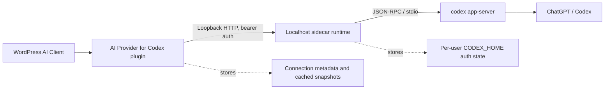

# AI Leadership 5 Ideation Artifact: AI Provider for Codex

## Artifact status

This artifact documents the AI-assisted ideation and iteration process behind `ai-provider-for-codex`, a shipped WordPress AI Client provider plugin.

The ideation prompts below are labeled as reconstructed prompts because the exact private AI chat transcripts are not confirmed recoverable. They are grounded in repo artifacts including `CLAUDE.md`, `LOCAL-SIDECAR-SPEC.md`, and the Superpowers specs/plans under `docs/superpowers/`.

## 1. Original problem

I wanted WordPress AI workflows to use Codex without requiring direct API billing, exposed secrets inside WordPress, or a fragile custom authentication flow.

The core architectural problem was deciding where authentication, billing, runtime state, and WordPress provider integration should live. The defining constraint became: the PHP plugin never talks to OpenAI or Codex directly. It talks only to a localhost sidecar runtime.

## 2. Reconstructed ideation prompts

### Prompt 1: Architecture option space

**Reconstructed prompt:**

> I am building a WordPress AI Client provider that lets WordPress workflows use Codex. I do not want WordPress to store Codex or OpenAI secrets or require direct API billing. What architectural patterns could connect a WordPress plugin to Codex while preserving security, user isolation, and a WordPress.org-style provider experience?

**Why this prompt was structured this way:**

This was the divergent prompt. I needed AI to widen the architecture space before committing to implementation. The goal was not to get code. The goal was to surface patterns I could compare.

**Options this helped generate:**

1. WordPress calls Codex directly.
2. WordPress stores auth state locally.
3. A hosted broker handles auth and runtime behavior.
4. A callback-based login flow connects users.
5. A localhost sidecar handles Codex runtime and auth.

**Resulting decision:**

The local sidecar survived because it kept secrets out of WordPress, preserved per-user isolation, avoided a hosted control plane, and let WordPress remain a normal provider plugin.

### Prompt 2: Authentication and per-user isolation

**Reconstructed prompt:**

> How should a WordPress plugin isolate per-user authentication state for an external AI runtime if the plugin should not store access tokens in WordPress options, user meta, or the database?

**Why this prompt was structured this way:**

This narrowed the problem from general architecture to the hardest constraint: auth state. I needed to know where account state should live and how to prevent one user's Codex account from becoming a shared site credential.

**Options this helped evaluate:**

1. Store tokens in WordPress user meta.
2. Store encrypted tokens in a custom WordPress table.
3. Use one shared site-wide Codex account.
4. Store per-user auth outside WordPress in runtime-owned storage.
5. Let a separate local process own device-code login and account snapshots.

**Resulting decision:**

The sidecar owns per-user `CODEX_HOME` storage. WordPress only stores connection metadata and cached account/model snapshots. That preserves account separation and avoids storing Codex auth secrets in WordPress.

### Prompt 3: Account connection UX

**Reconstructed prompt:**

> For a WordPress admin user connecting a Codex or ChatGPT account, what are the tradeoffs between device-code login, callback-based OAuth, and a manual setup flow? The browser should never talk directly to the localhost sidecar, and the flow needs to work from wp-admin.

**Why this prompt was structured this way:**

This prompt focused on user experience and browser constraints after the sidecar architecture was selected. I needed to decide how users would actually connect accounts without violating the runtime boundary.

**Options this helped evaluate:**

1. Full callback-based OAuth.
2. Manual copy/paste setup.
3. Redirecting users to a separate connection page.
4. Device-code login with WordPress REST polling.
5. Progressive enhancement from the Connectors screen and user connection page.

**Resulting decision:**

Device-code login was the best fit. It avoided public callback endpoints, worked inside wp-admin, kept browser traffic routed through WordPress REST, and allowed the sidecar to own Codex auth.

## 3. Rejection criteria

The weaker options were rejected using these criteria:

1. Preserve WordPress AI Client compatibility.
2. Keep each WordPress user's Codex account isolated.
3. Do not store Codex auth secrets in WordPress options, user meta, or custom tables.
4. Do not let browser JavaScript talk directly to the localhost sidecar.
5. Preserve a WordPress.org-style provider UX.
6. Avoid a hosted control plane unless it is actually required.
7. Make the architecture enforceable through repeatable verification.

## 4. Chosen architecture

The selected direction was a local sidecar architecture.

WordPress stays the provider plugin. It owns provider registration, wp-admin UX, local settings, cached metadata, and WordPress REST endpoints. The localhost sidecar owns Codex runtime behavior, ChatGPT/Codex authentication, and per-user account state.

### Core boundary

The important architectural boundary is that WordPress does not own Codex auth. WordPress only coordinates provider UX and local metadata. The sidecar owns runtime/auth behavior.

## 5. Iteration trail: local runtime generation transport

I selected the local runtime generation transport fix as the iteration trail because it shows AI-assisted refinement from review finding to architectural correction to regression-proof enforcement.

### Exchange 1: Diagnose the transport regression

**Me -> AI:**

> Review the generation transport change. I want Codex to remain registered as a normal WordPress AI Client provider, but generation needs to reach the documented localhost sidecar URL.

**AI -> Me:**

The AI identified that routing generation through the WordPress AI Client HTTP transporter was wrong for this runtime boundary because that path used `wp_safe_remote_request()`, which rejected `http://127.0.0.1:4317`. The local sidecar was reachable through `wp_remote_request()`, so the issue was not the sidecar. The issue was the safe transporter path.

**Annotation:**

This exchange separated the actual bug from the architecture. The problem was not "the sidecar does not work." The problem was that I had routed local runtime traffic through an abstraction designed for safe external HTTP requests.

### Exchange 2: Preserve provider registration while fixing runtime traffic

**Me -> AI:**

> Do not bypass the WordPress AI Client provider/model contract. Fix the local transport problem while keeping Codex available as a normal provider.

**AI -> Me:**

The AI proposed keeping provider registration and model creation inside the WordPress AI Client, but sending actual sidecar generation requests through the plugin's existing `Runtime\Client::post()` path. That preserved the provider contract while respecting the local runtime boundary.

**Annotation:**

This was the key architectural refinement. The provider interface and the runtime transport did not need to be the same abstraction. WordPress AI Client remains the public provider surface. The plugin runtime client remains responsible for localhost sidecar traffic.

### Exchange 3: Turn the fix into a regression-proof change

**Me -> AI:**

> Make this release-safe. I do not want the same loopback transport mistake to come back later.

**AI -> Me:**

The AI produced a plan to add verification coverage in `scripts/verify.php`, remove the unused transporter helper, update the readiness checklist, and run release-style checks. The regression test specifically covered text generation through the default loopback runtime URL.

**Annotation:**

This moved the work from "patch the bug" to "protect the boundary." The important lesson was that architectural decisions need executable checks. The local sidecar boundary became part of the release contract.

### Exchange 4: Scope control

**Me -> AI:**

> Do not expand this into AI request logging, global transporter replacement, or broader provider behavior changes.

**AI -> Me:**

The AI added explicit non-goals: do not change admin/auth/snapshot traffic, do not widen the sidecar beyond loopback, do not register a global replacement HTTP transporter, and do not claim AI Request Logging support in this fix.

**Annotation:**

This prevented control-plane complexity from creeping back in. The final fix was smaller and stronger because it protected the core boundary instead of trying to solve every related integration concern at once.

## 6. Reflection

AI was most useful when I used it to widen the architecture space before implementation. It helped generate options I might have collapsed too quickly: direct WordPress-to-Codex calls, WordPress-stored auth, a hosted broker, callback-based login, and a local sidecar. The value was not that every option was good. The value was that I had a broader set of possibilities to reject using concrete constraints.

AI was weaker when the conversation drifted toward more control-plane complexity. Without constraint pressure, it was easy for the design to accumulate extra layers: callback flows, broker-style services, broader transporter abstractions, or integration hooks that sounded useful but did not serve the core product boundary. The project improved when I forced every idea through the same criteria: WordPress AI Client compatibility, per-user isolation, no token storage in WordPress, no browser-to-sidecar traffic, WordPress.org-style UX, and repeatable verification.

The meta-lesson is divergence first, then constraint-driven convergence. I should use AI early to generate architecture options, but I should not treat those options as recommendations until they survive real constraints. On future projects, I would repeat this pattern deliberately: ask AI for competing designs, define rejection criteria, choose the simplest boundary that satisfies the constraints, then encode that boundary in specs and verification scripts. AI is most useful when it produces options I can eliminate, not just code I can accept.

## 7. Evidence sources

Primary repo artifacts:

1. [`CLAUDE.md`](CLAUDE.md) - repo guidance describing the defining sidecar constraint and runtime boundary.
2. [`LOCAL-SIDECAR-SPEC.md`](LOCAL-SIDECAR-SPEC.md) - implementation spec for the local sidecar architecture, goals, non-goals, and sidecar contract.
3. [`docs/superpowers/plans/2026-05-21-local-runtime-generation-transport.md`](docs/superpowers/plans/2026-05-21-local-runtime-generation-transport.md) - iteration plan for the loopback generation transport correction.
4. [`docs/superpowers/specs/2026-05-22-codex-connect-ux-design.md`](docs/superpowers/specs/2026-05-22-codex-connect-ux-design.md) - UX architecture spec for the account connection flow.
5. [`docs/superpowers/plans/2026-05-22-codex-connect-ux.md`](docs/superpowers/plans/2026-05-22-codex-connect-ux.md) - implementation plan for the shared connection controller and enhanced Connectors/user-page flow.
6. [`docs/superpowers/plans/2026-05-22-connection-flow-review-remediation.md`](docs/superpowers/plans/2026-05-22-connection-flow-review-remediation.md) - review remediation plan showing post-implementation iteration and regression coverage.

GitHub repo:

https://github.com/henryperkins/ai-provider-for-codex
